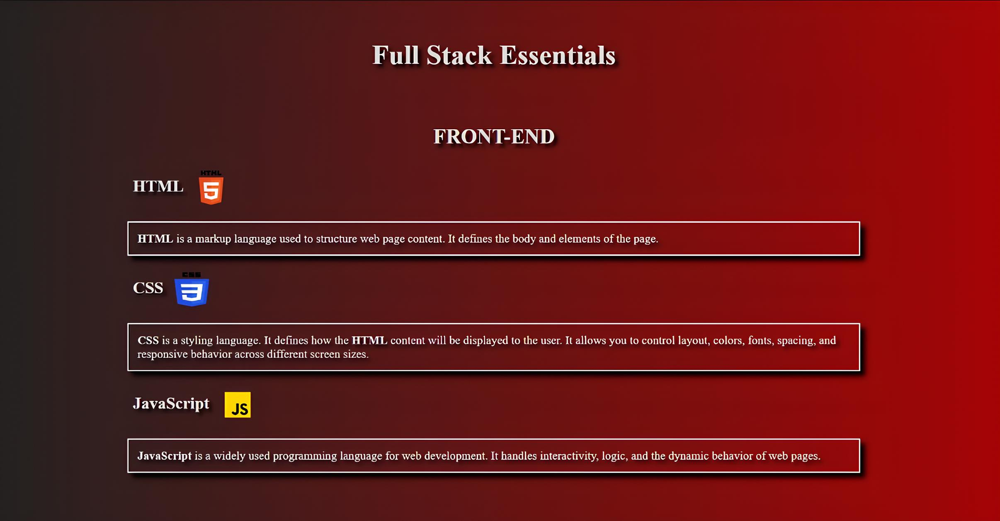

# Fullstack Essentials

A basic, simple and responsive webpage that introduces the main technologies used in Full-Stack, including Front-End, Back-End, Databases, Git and Github.

## Preview

## Features

- Structured with HTML5.
- Styled using CSS3 with gradients, shadows, and responsive layout.
- Includes logos for better visual identification.
- Organized by sections.

## Summary

### Front-End
- **HTML**
- **CSS**
- **JavaScript**

### Back-End
- **Python**
- **Node.js**
- **Java**
- **C#**

### Databases
- **SQLite**
- **MySQL**
- **PostgreSQL**
- **MongoDB**

### Version Control and Hosting Platform
- **Git**
- **GitHub**

## Access

Acess [fullstack-essentials](https://gui-main.github.io/fullstack-essentials/)